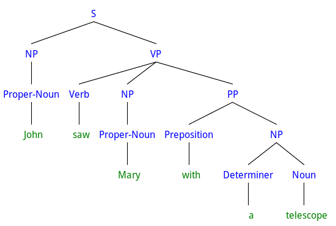

[Rley](https://github.com/famished-tiger/Rley)
====
[](https://travis-ci.org/famished-tiger/Rley)
[](https://ci.appveyor.com/project/famished-tiger/rley)
[](https://coveralls.io/r/famished-tiger/Rley?branch=master)
[](http://badge.fury.io/rb/rley)
[](https://gemnasium.com/famished-tiger/Rley)
[](http://inch-ci.org/github/famished-tiger/Rley)
[](https://github.com/famished-tiger/Rley/blob/master/LICENSE.txt)

A Ruby library for constructing general parsers for _any_ context-free language.  

What is Rley?
-------------
__Rley__ uses the [Earley](http://en.wikipedia.org/wiki/Earley_parser)
algorithm which is a general parsing algorithm that can handle any context-free
grammar. Earley parsers can literally swallow anything that can be described
by a context-free grammar. That's why Earley parsers find their place in so
many __NLP__ (_Natural Language Processing_) libraries/toolkits.  

In addition, __Rley__ goes beyond most Earley parser implementations by providing
support for ambiguous parses. Indeed, it delivers the results of a parse as a
_Shared Packed Parse Forest_ (SPPF). A SPPF is a data structure that allows to
encode efficiently all the possible parse trees that result from an ambiguous
grammar.  

As another distinctive mark, __Rley__ is also the first Ruby implementation of a
parsing library based on the new [Grammar Flow Graph](#grammar-flow-graph) approach .

### What it can do?
Maybe parsing algorithms and internal implementation details are of lesser
interest to you and the good question to ask is "what Rley can really do?".  

In a nutshell:  
* Rley can parse context-free languages that other well-known libraries cannot
handle  
* Built-in support for ambiguous grammars that typically occur in NLP

In short, the foundations of Rley are strong enough to be useful in a large
application range such as:  
* computer languages,  
* artificial intelligence and  
* Natural Language Processing.

### Features
* Simple API for context-free grammar definition,
* Allows ambiguous grammars,
* Generates shared packed parse forests,
* Accepts left-recursive rules/productions,
* Provides syntax error detection and reporting.


### Compatibility
Rley supports the following Ruby implementations:  
- MRI 2.0  
- MRI 2.1  
- MRI 2.2  
- MRI 2.3
- MRI 2.4  
- JRuby 9.1+  

---

Getting Started
---------------

### Installation
Installing the latest stable version is simple:

    $ gem install rley


## A whirlwind tour of Rley
The purpose of this section is show how to create a parser for a minimalistic
English language subset.
The tour is organized as follows:  
1. [Defining the language grammar](#defining-the-language-grammar)  
2. [Creating a lexicon](#creating-a-lexicon)  
3. [Creating a tokenizer](#creating-a-tokenizer)  
4. [Building the parser](#building-the-parser)  
5. [Parsing some input](#parsing-some-input)  
6. [Generating the parse tree](#generating-the-parse-tree)

The complete source code of the example used in this tour can be found in the
[examples](https://github.com/famished-tiger/Rley/tree/master/examples/NLP/mini_en_demo.rb)
directory

### Defining the language grammar
The subset of English grammar is based on an example from the NLTK book.

```ruby  
    require 'rley' # Load Rley library

    # Instantiate a builder object that will build the grammar for us
    builder = Rley::Syntax::GrammarBuilder.new do
      # Terminal symbols (= word categories in lexicon)
      add_terminals('Noun', 'Proper-Noun', 'Verb')
      add_terminals('Determiner', 'Preposition')

      # Here we define the productions (= grammar rules)
      rule 'S' => %w[NP VP]
      rule 'NP' => 'Proper-Noun'
      rule 'NP' => %w[Determiner Noun]
      rule 'NP' => %w[Determiner Noun PP]
      rule 'VP' => %w[Verb NP]
      rule 'VP' => %w[Verb NP PP]
      rule 'PP' => %w[Preposition NP]
    end
    # And now, let's build the grammar...
    grammar = builder.grammar
```  

## Creating a lexicon

```ruby
    # To simplify things, lexicon is implemented as a Hash with pairs of the form:
    # word => terminal symbol name
    Lexicon = {
      'man' => 'Noun',
      'dog' => 'Noun',
      'cat' => 'Noun',
      'telescope' => 'Noun',
      'park' => 'Noun',  
      'saw' => 'Verb',
      'ate' => 'Verb',
      'walked' => 'Verb',
      'John' => 'Proper-Noun',
      'Mary' => 'Proper-Noun',
      'Bob' => 'Proper-Noun',
      'a' => 'Determiner',
      'an' => 'Determiner',
      'the' => 'Determiner',
      'my' => 'Determiner',
      'in' => 'Preposition',
      'on' => 'Preposition',
      'by' => 'Preposition',
      'with' => 'Preposition'
    }.freeze
```  


## Creating a tokenizer
```ruby
    # A tokenizer reads the input string and converts it into a sequence of tokens
    # Highly simplified tokenizer implementation.
    def tokenizer(aTextToParse, aGrammar)
      tokens = aTextToParse.scan(/\S+/).map do |word|
        term_name = Lexicon[word]
        raise StandardError, "Word '#{word}' not found in lexicon" if term_name.nil?
        terminal = aGrammar.name2symbol[term_name]
        Rley::Tokens::Token.new(word, terminal)
      end

      return tokens
    end
```

More ambitious NLP applications will surely rely on a Part-of-Speech tagger instead of
creating a lexicon and tokenizer from scratch. Here are a few Ruby Part-of-Speech gems:  
* [engtagger](https://rubygems.org/gems/engtagger)
* [rbtagger](https://rubygems.org/gems/rbtagger)


## Building the parser
```ruby
  # Easy with Rley...
  parser = Rley::Parser::GFGEarleyParser.new(grammar)
```


## Parsing some input
```ruby
    input_to_parse = 'John saw Mary with a telescope'
    # Convert input text into a sequence of token objects...
    tokens = tokenizer(input_to_parse, grammar)
    result = parser.parse(tokens)

    puts "Parsing successful? #{result.success?}" # => Parsing successful? true
```

At this stage, we're done with parsing. What we need next are convenient means
to exploit the parse result. As it is, the `result` variable in the last code snippet
above is a data structure ("Earley item sets") that is highly depending on the intricate details
of the Earley's parsing algorithm. Obviously, it contains all the necessary data to exploit
the parsing results but it is rather low-level and inconvenient from a programming viewpoint.
Therefore, __Rley__ provides out of the box two convenient data structures for
representing the parse outcome:
- Parse tree (optimal when the parse is unambiguous)   
- Parse forest (a more sophisticated data structure that copes with ambiguity)

For our whirlwind tour, we will opt for parse trees.

## Generating the parse tree

```ruby
    ptree = result.parse_tree
```  
OK. Now that we have the parse tree, what we can do with it?
One option is to manipulate the parse tree and its node directly. For instance,
one could write code to customize and transform the parse tree. This approach gives
most the of flexibility needed for advanced applications. The other, more common
option is to use an `Rley::ParseTreeVisitor` instance.
Such a visitor walks over the parse tree nodes and generates visit events that
are dispatched to subscribed event listeners. All this may, at first, sound
complicated but the coming code snippets show it otherwise.

Let's do it by:  
- Creating a parse tree visitor  
- Using one of the built-in visit subscribers specifically created to render the
 parse tree in a given output format.  

### Creating a parse tree visitor  
Good news: creating a parse tree visitor for the parse tree `ptree` is just
an one-liner:

```ruby
    # Let's create a parse tree visitor
    visitor = Rley::ParseTreeVisitor.new(ptree)
```

### Visiting the parse tree

Unsurprisingly, to start the parse tree visit, one calls the `#start` method:

```ruby
    visitor.start
```

If you try the above line, no particular result will be visible and for a good reason:
no object was specified as a visit event subscriber. As a convenience, __Rley__
bundles a number of [formatter classes](https://github.com/famished-tiger/Rley/tree/master/lib/rley/formatter)
that were designed to listen to the visit event and then render the parse tree
in a specific format. To begin with, we'll use the simple formatter
`Rley::Formatter::Debug` class. Its purpose is just to print out the visit event
name.

Remove the line with the call to the `#start` method and replace it with the two
statements:
```ruby
    # Let's create a formatter (i.e. visit event listener)
    renderer = Rley::Formatter::Debug.new($stdout)

    # Subscribe the formatter to the visitor's event and launch the visit
    renderer.render(visitor)    
```

These two lines will generate the following output:
```
before_ptree
  before_non_terminal
    before_subnodes
      before_non_terminal
        before_subnodes
          before_terminal
          after_terminal
        after_subnodes
      after_non_terminal
      before_non_terminal
        before_subnodes
          before_terminal
          after_terminal
          before_non_terminal
            before_subnodes
              before_terminal
              after_terminal
            after_subnodes
          after_non_terminal
          before_non_terminal
            before_subnodes
              before_terminal
              after_terminal
              before_non_terminal
                before_subnodes
                  before_terminal
                  after_terminal
                  before_terminal
                  after_terminal
                after_subnodes
              after_non_terminal
            after_subnodes
          after_non_terminal
        after_subnodes
      after_non_terminal
    after_subnodes
  after_non_terminal
after_ptree
```

At least is something visible: these are the parse tree visit events.
Note that the indentation of event names depends on the nesting level of
the tree node being visited.

Not really impressive? So let's use another formatter...

### Visualizing the parse tree structure
If one replaces the previous formatter by an instance of
`Rley::Formatter::Asciitree` the output now shows the parse tree structure.

```ruby
    # Let's create a formatter that will render the parse tree with characters
    renderer = Rley::Formatter::Asciitree.new($stdout)

    # Subscribe the formatter to the visitor's event and launch the visit
    renderer.render(visitor)   
```

The outputs looks like this:
```
S
+-- NP
|   +-- Proper-Noun: 'John'
+-- VP
    +-- Verb: 'saw'
    +-- NP
    |   +-- Proper-Noun: 'Mary'
    +-- PP
        +-- Preposition: 'with'
        +-- NP
            +-- Determiner: 'a'
            +-- Noun: 'telescope'
```

If you are more inclined for graphical representation, then replace the last formatter
by yet another one:

```ruby
    # Let's create a formatter that will render the parse tree in labelled bracket notation
    renderer = Rley::Formatter::BracketNotation.new($stdout)

    # Subscribe the formatter to the visitor's event and launch the visit
    renderer.render(visitor)   
```

This results in the strange-looking output:
```
[S [NP [Proper-Noun John]][VP [Verb saw][NP [Proper-Noun Mary]][PP [Preposition with][NP [Determiner a][Noun telescope]]]]]
```

This output is in a format that is recognized by many NLP softwares.
The next diagram was created by copy-pasting the output above in the online tool
[RSyntaxTree](http://yohasebe.com/rsyntaxtree/).
By the way, this tool is also a Ruby gem, [rsyntaxtree](https://rubygems.org/gems/rsyntaxtree).




## Error reporting
__Rley__ is a non-violent parser, that is, it won't throw an exception when it
detects a syntax error. Instead, the parse result will be marked as
non-successful. The parse error can then be identified by calling the
`GFGParsing#failure_reason` method. This method returns an error reason object
which can help to produce an error message.  

Consider the example from the [Parsing some input](#parsing-some-input) section
above and, as an error, we delete the verb `saw` in the sentence to parse.  

```ruby
    # Verb has been removed from the sentence on next line
    input_to_parse = 'John Mary with a telescope'
    # Convert input text into a sequence of token objects...
    tokens = tokenizer(input_to_parse, grammar)
    result = parser.parse(tokens)

    puts "Parsing successful? #{result.success?}" # => Parsing successful? false
    exit(1)
```

As expected, the parse is now failing.  
To get an error message, one just need to retrieve the error reason and
ask it to generate a message.  
```ruby
    # Show error message if parse fails...
    puts result.failure_reason.message unless result.success?
```

Re-running the example with the error, results in the error message:
```
  Syntax error at or near token 2 >>>Mary<<<
  Expected one 'Verb', found a 'Proper-Noun' instead.
```

The standard __Rley__ message not only inform about the location of
the mistake, it also provides some hint by disclosing its expectations.

Let's experiment again with the original sentence but without the word
`telescope`.

```ruby
    # Last word has been removed from the sentence on next line
    input_to_parse = 'John saw Mary with a '
    # Convert input text into a sequence of token objects...
    tokens = tokenizer(input_to_parse, grammar)
    result = parser.parse(tokens)

    puts "Parsing successful? #{result.success?}" # => Parsing successful? false
    unless result.success?
      puts result.failure_reason.message
      exit(1)
    end
```

This time, the following output is displayed:
```
  Parsing successful? false
  Premature end of input after 'a' at position 5
  Expected one 'Noun'.
```
Again, the resulting error message is user-friendly.  
Remark: currently, Rley reports an error position as the index of the  
input token with which the error was detected.


## Examples

The project source directory contains several example scripts that demonstrate
how grammars are to be constructed and used.


## Other similar Ruby projects
__Rley__ isn't the sole implementation of the Earley parser algorithm in Ruby.  
Here are a few other ones:  
- [Kanocc gem](https://rubygems.org/gems/kanocc) -- Advertised as a Ruby based parsing and translation framework.  
  Although the gem dates from 2009, the author still maintains its in a public repository in [Github](https://github.com/surlykke/Kanocc)  
  The grammar symbols (tokens and non-terminals) must be represented as (sub)classes.
  Grammar rules are methods of the non-terminal classes. A rule can have a block code argument
  that specifies the semantic action when that rule is applied.  
- [lc1 project](https://github.com/kp0v/lc1) -- Advertised as a combination of Earley and Viterbi algorithms for [Probabilistic] Context Free Grammars   
  Aimed in parsing brazilian portuguese.  
  [earley project](https://github.com/joshingly/earley) -- An Earley parser (grammar rules are specified in JSON format).  
  The code doesn't seem to be maintained: latest commit dates from Nov. 2011.  
- [linguist project](https://github.com/davidkellis/linguist) -- Advertised as a library for parsing context-free languages.  
  It is a recognizer not a parser. In other words it can only tell whether a given input
  conforms to the grammar rules or not. As such it cannot build parse trees.  
  The code doesn't seem to be maintained: latest commit dates from Oct. 2011.

## Other interesting Ruby resources
The extensive resource list not to miss: [Awesome NLP with Ruby](https://github.com/arbox/nlp-with-ruby)
actively curated by Andrei Beliankou (aka arbox).

##  Thanks to:
* Professor Keshav Pingali, one of the creators of the Grammar Flow Graph parsing approach for his encouraging e-mail exchange.

## Grammar Flow Graph
Since the Grammar Flow Graph parsing approach is quite new, it has not yet taken a place in
standard parser textbooks. Here are a few references (and links) of papers on GFG:    
- K. Pingali, G. Bilardi. [Parsing with Pictures](http://apps.cs.utexas.edu/tech_reports/reports/tr/TR-2102.pdf)
- K. Pingali, G. Bilardi. [A Graphical Model for Context-Free Grammar Parsing.](https://link.springer.com/chapter/10.1007/978-3-662-46663-6_1)
  In : International Conference on Compiler Construction. Springer Berlin Heidelberg, 2015. p. 3-27.  
- M. Fulbright. [An Evaluation of Two Approaches to Parsing](http://apps.cs.utexas.edu/tech_reports/reports/tr/TR-2199.pdf)  


Copyright
---------
Copyright (c) 2014-2017, Dimitri Geshef.  
__Rley__ is released under the MIT License see [LICENSE.txt](https://github.com/famished-tiger/Rley/blob/master/LICENSE.txt) for details.
